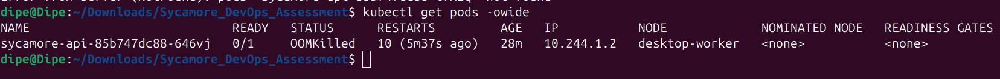
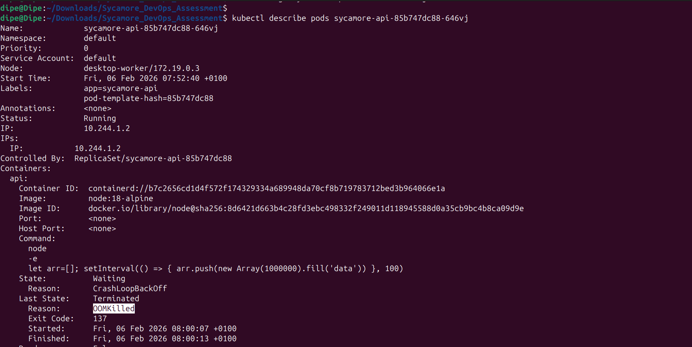
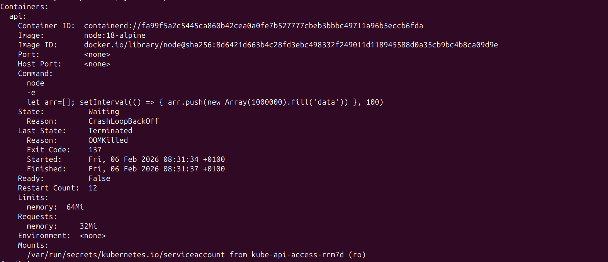
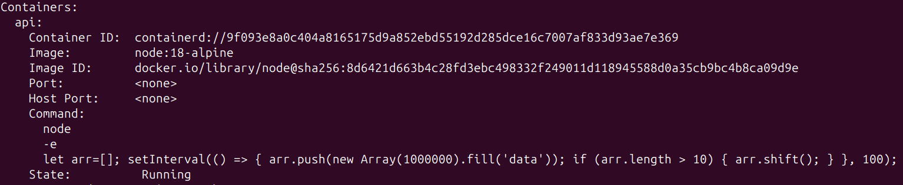
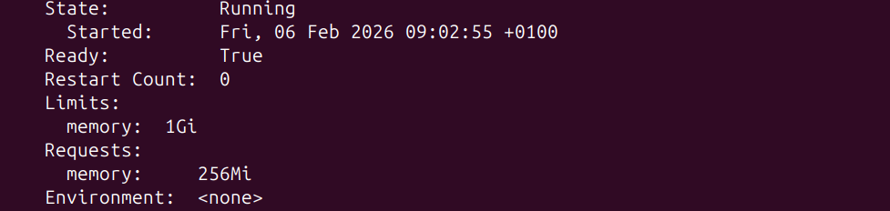
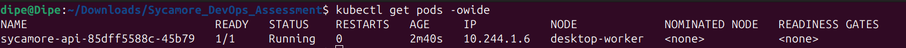

# Root Cause Analysis (RCA) Report

### Problem Definition
A Kubernetes pod was terminated with an OOMKilled (Out of Memory) status after exceeding its allocated memory limit. Memory usage kept increasing until Kubernetes killed the pod to protect the node.
As a result, the application became unstable, leading to downtime and failed request handling.

### Root Cause
The issue was caused by a combination of two main factors:
1. Application-Level Memory Leak
The application continuously allocated memory by pushing large arrays into a variable without releasing them. At each interval, an array of about one million items was added, causing memory usage to grow rapidly. Since there was no cleanup or limit in place, memory consumption kept increasing until it exceeded the pod’s memory limit.

2. Insufficient Memory Allocation in the Kubernetes Manifest
The pod was configured with a memory request of 32Mi and a memory limit of 64Mi, which was far too low for the application’s actual memory usage—especially with the existing memory leak. Once the limit was exceeded, Kubernetes terminated the pod, resulting in repeated OOMKilled events. 

The memory leak in the application and the low memory limits in the Kubernetes configuration directly caused the issue.

### Corrective and Preventative Measures
- Fixing the Application Memory Leak
The application was updated to prevent memory leaks by managing large arrays more efficiently. Instead of allowing arrays to grow indefinitely, their size is now capped. Once the limit is reached, the array is cleared or trimmed, ensuring memory is properly released and preventing excessive usage.

- Updating Kubernetes Memory Configuration
The pod’s memory settings were adjusted to better match the application’s needs, memory request was increased to 256Mi and memory limit was increased to 1Gi, these changes provide enough memory for the application to run reliably under expected workloads.

After applying the above steps the pod is now running fine
